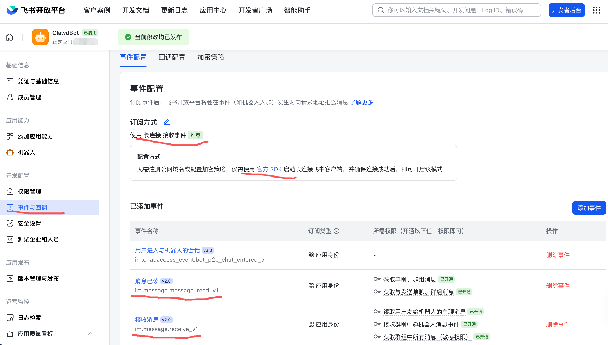
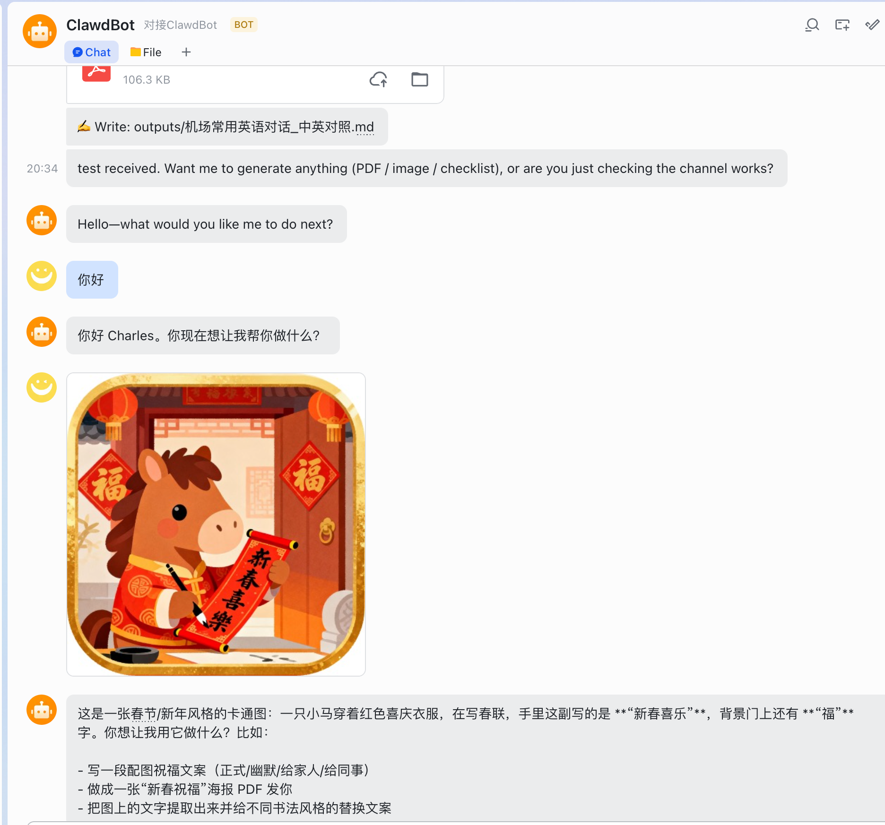
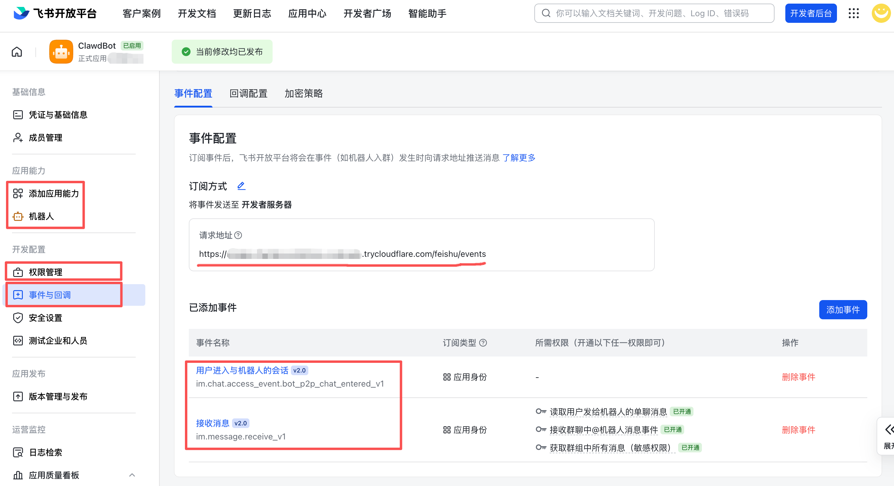

# Feishu bridge for OpenClaw（兼容长连接和开发者服务器方式）

> Maintainer: **Charles Chern @AIlinker**  
> Repo: <https://github.com/yearnst/feishu-bridge-for-openclaw>

一个本地飞书/Lark 桥接服务（开源版）：接收飞书事件订阅回调 → 转发到本机 **OpenClaw（新名，推荐）/ Clawdbot（旧名，兼容）** → 把模型回复（含附件）发回飞书。

An open-source local Feishu/Lark bridge: receive Event Subscription callbacks → forward to local **OpenClaw (recommended) / Clawdbot (legacy)** → reply back to Feishu (supports files/images).

- 中文详细文档：`README.zh-CN.md`
- English docs: `README.en.md`

---

## Features / 功能

**Inbound（Feishu → Local）**
- Event Subscription URL verification (`challenge`)
- Receive **text / image / file**
- Group gating: only reply when **@mentioned** (configurable)
- Inbound attachments: auto-download to `FEISHU_DOWNLOAD_DIR`, then forward to the agent as `FILE: <local-path>`

**Outbound（Local → Feishu）**
- Reply to the same chat (p2p / group)
- Outbound attachments: if the agent reply contains `FILE:` / `MEDIA:` local paths, auto-upload + send back
- PDF upload uses `file_type=pdf`
- Strip internal tool noise (e.g. `🛠️ Exec: ...`) from messages

**No-timeout UX（不超时体验）**
- Per-session queue (serial processing)
- Delayed “后台处理…任务ID…” hint (default 120s)
- Optional periodic progress ping

**Encryption（已支持）**
- Supports encrypted callbacks `{ "encrypt": "..." }` via `FEISHU_ENCRYPT_KEY`

---

## Prerequisites / 准备工作

- Node.js **22+** recommended (matches OpenClaw guidance)
- OpenClaw installed globally (recommended):

```bash
npm install -g openclaw@latest
openclaw onboard --install-daemon
```

- A public HTTPS callback URL
  - local dev: tunnel (cloudflared / ngrok / localtunnel)
  - server: your domain + HTTPS reverse proxy
- A Feishu/Lark app (App ID / Secret) with IM + file/image permissions

---

## Quick start / 快速开始（双语）

> 默认推荐：**Socket Mode（长连接）**，本地开发无需公网 URL / tunnel。

### 1) Install / 安装

```bash
cp .env.example .env
npm install
```

### 2A) Socket Mode（Recommended）/ 长连接模式（推荐）

Feishu 控制台：事件订阅 → 订阅方式选择 **长连接（Socket Mode）**，订阅事件 `im.message.receive_v1`。

`.env`（最小配置）：

```env
FEISHU_RECEIVE_MODE=socket
HTTP_SERVER_ENABLED=false
```

Run / 运行：

```bash
npm run start:socket
```

### 2B) Webhook Mode / 回调模式（需要公网 URL 或 tunnel）

Feishu 控制台：事件订阅 → 订阅方式选择 **开发者服务器（Webhook）**，Request URL 指向：
`https://<your-domain-or-tunnel>/feishu/events`

`.env`（最小配置）：

```env
FEISHU_RECEIVE_MODE=webhook
HTTP_SERVER_ENABLED=true
PORT=8787
FEISHU_VERIFICATION_TOKEN=...   # optional but recommended
FEISHU_ENCRYPT_KEY=...          # optional (32 bytes)
```

Run / 运行：

```bash
npm run start:webhook
```

Health check / 健康检查：`GET http://127.0.0.1:8787/health`

---

## Docs / 文档

- 中文：`README.zh-CN.md` / `DEPLOY.zh-CN.md`
- English: `README.en.md` / `DEPLOY.en.md`

Tip / 提示：首次联调建议先用 `ECHO_MODE=true`，确认机器人能回声，再切 `ECHO_MODE=false` 走模型转发。

---

## Screenshots / 截图

<details>
<summary>Click to expand / 点击展开</summary>

### Socket Mode / 长连接





### Webhook Mode / 回调



</details>

---

## Deploy (Server / Docker) / 部署（服务器 / Docker）

```bash
cp .env.example .env
# edit .env

docker compose up -d --build

docker compose logs -f
```

Reverse proxy (HTTPS) required:
- `https://your.domain/feishu/events` → `http://127.0.0.1:8787/feishu/events`

---

## Configuration highlights / 常用配置

- `ECHO_MODE=true|false` — wiring test vs real forwarding
- `REQUIRE_MENTION_IN_GROUP=true|false` — only respond on @ in groups
- `FEISHU_ENCRYPT_KEY=<32-bytes>` — enable encrypted callbacks
- `PDF_CJK_FONT_PATH=./fonts/NotoSansCJKsc-Regular.otf` — bundled font (see `./fonts/OFL.txt`)

---

## Docs / 更多文档

- Deploy (CN): `DEPLOY.zh-CN.md`
- Deploy (EN): `DEPLOY.en.md`

---

## License

MIT — see `LICENSE`.
